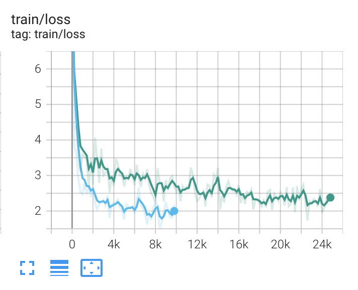
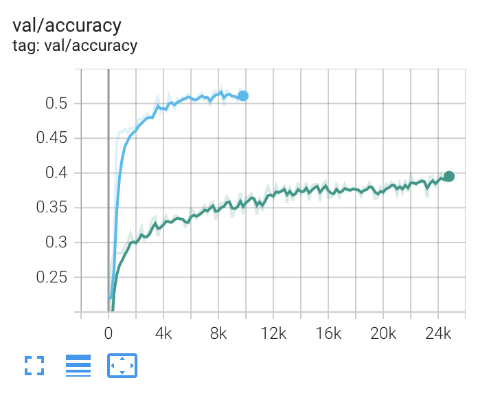
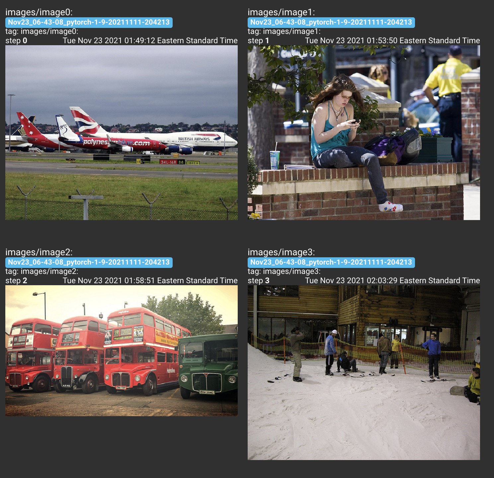
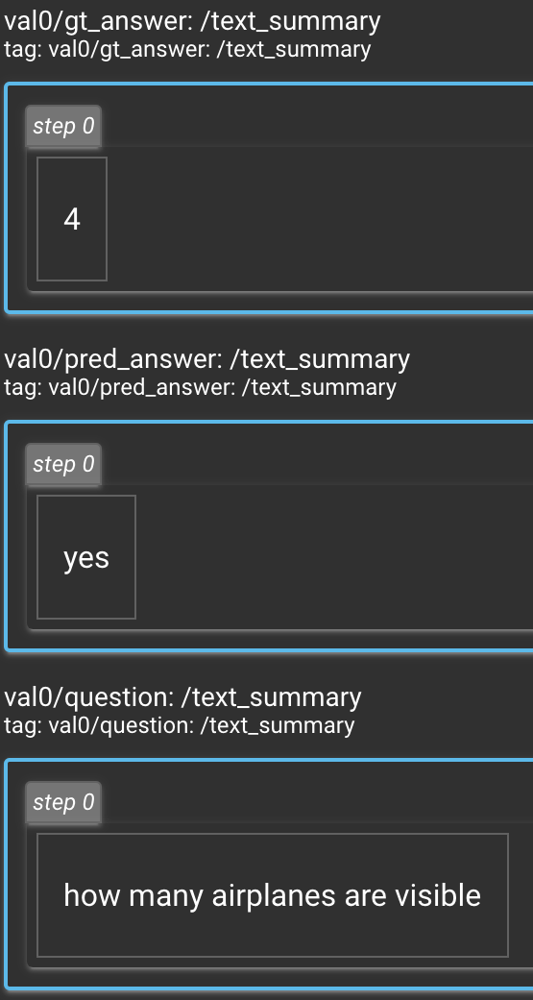
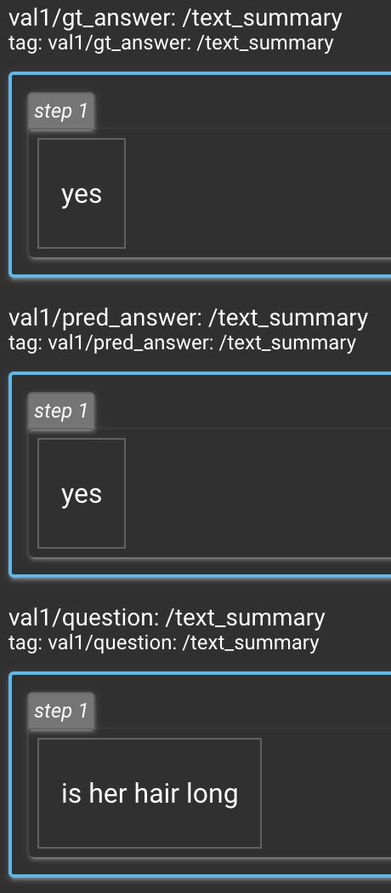
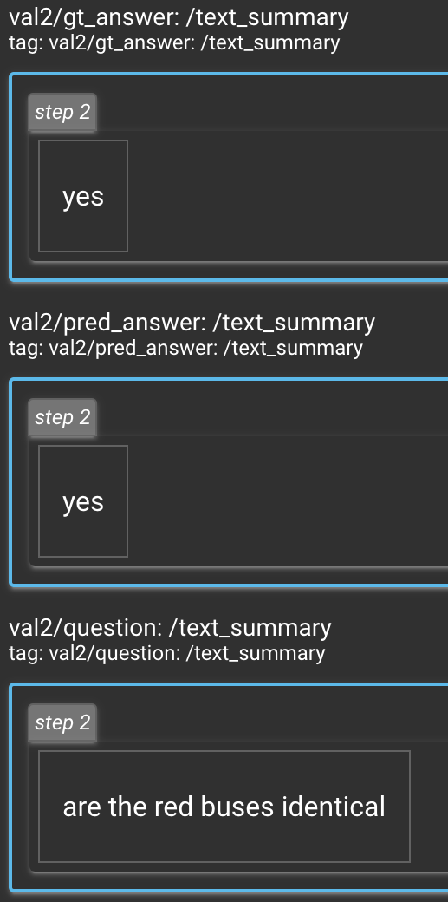
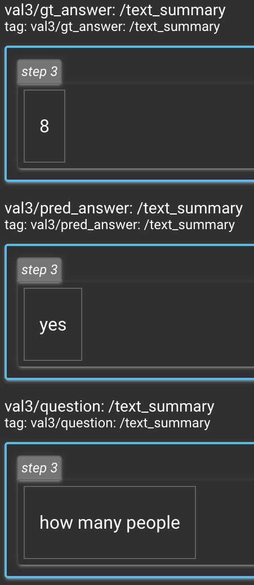

# Hierarchical VQA using Alternating Co-Attention

This repository was created in partial fulfillment for the course [Visual Learning and Recognition (16-824) Fall 2021](https://visual-learning.cs.cmu.edu/), which I took at CMU. 


We use [PyTorch](pytorch.org) to create our models and [TensorBoard](https://www.tensorflow.org/tensorboard/) for visualizations and logging. This repository contains a PyTorch implementation of the following papers:

1. Simple Baseline for Visual Question Answering (Zhou et al, 2015): https://arxiv.org/pdf/1512.02167.pdf

2. Hierarchical Question-Image Co-Attention for Visual Question Answering (Lu et al, 2017):  https://arxiv.org/pdf/1606.00061.pdf

## Results
We should note that we exclude the unknown ground truth answers durign training. If the unknown answers are included, then we observe a 10%. Below, we show the baseline (green) performance in comparison with the co-attention method (blue).

<p align="center">
 
</p>

### Sample Answers
We include sample answers from the co-attention model below. We also include the four pictures that are in question.

<p align="center">
 
</p>

<p align="center">
   
</p>

## Getting Started

### Software setup

We will use the following python libraries for the homework:

1. Python 3.6
2. PyTorch 1.6.0
3. VQA Python API (https://github.com/GT-Vision-Lab/VQA)
4. tensorboardX

A python 3.6 compatible VQA API has been provided in the `external` folder of this repository, courtesy of [16-824: VLR](https://visual-learning.cs.cmu.edu/).

### Downloading dataset

The full dataset itself is quite large (the COCO training images are ~13 GB, for instance), and we need to download (only 'Real Images', not 'Abstract Scenes') the train and validation data from [here](https://visualqa.org/vqa_v1_download.html) .

#### Option 1: using our script
You can run the `get-dataset.sh` script to get all the necessary data.

```
bash get-dataset.sh
```

#### Option 2: Manual Download

1. You'll need to get all three things: the annotations, the questions, and the images for both the training and validation sets.
    1. We're just using the validation set for testing, for simplicity. (In other words, we're not creating a separate set for parameter tuning.)
1. If you're using AWS Volumes we suggest getting a volume with at least 50 GB for caching.
1. We're using VQA v1.0 Open-Ended for easy comparison to the baseline papers.

Download the files to a single folder. After that, `unzip` the files. Now you should have a directory `$DATA` containing the following items.

    mscoco_train2014_annotations.json
    mscoco_val2014_annotations.json
    OpenEnded_mscoco_train2014_questions.json
    OpenEnded_mscoco_val2014_questions.json
    train2014/
    val2014/

### Design decisions for data loading with PyTorch

We implemented customized dataloader, a subclass of `torch.utils.data.Dataset` (https://pytorch.org/docs/stable/data.html), 
to provide easy access to the VQA data, and includes multi-threaded data loading. You will find the details in the file `student_code/vqa_dataset.py`. We use a closed vocabulary for the question embedding. In other words, we choose a set of words that has the **highest frequency** in the training set. All the remaining words will be considered as an 'unknown' class.


Some answers could have multiple words, such as semi circle. Despite the fact that such answers comprise of multiple words, they must be treated as an atomic answer, where the entire phrase is treated as the answer and the corresponding token/ID is generated for the phrase/sentence. Thus we have one ID per sentence.

If the question length is larger than 26, we trim the question and ignore the words after the 26th word. We handle questions of variable length less than 26, by padding our sequence. The output shape of the question tensor is (26 x 5747). We create sentence-level **one-hot encodings** for the answers. 10 answers are provided for each question. We encode each of them and stack them together, giving us an output shape of the answer tensor is (10 x 5217). Again, we make sure to handle the answers not in the answer list by mapping them to an 'unknown' class.

## Pytorch Implementation of Simple Baseline
We describe the implementation of the simple method described in [2]. This serves to validate our Co-Attention model and provides a strong baseline for comparison.

To run the code, you can do:

```python
python -m driver_code.main --log_validation --num_epochs 4
```

We implement a frquency based adaptation of the bag of word representation, which is a vector that encodes a sentence based on the frequency of the words that appear in it. We can create a bag of words representation by summing the tensor along the sentence dimension, and converting it into the 0-1 representation by just assigning 1 to values greater than 0. For the bag of words vector, the paper mentioned that the output should be converted to the range of [0, 1]. However, in my implementation I used the frequency vectors and observed competitive performance.

The advantages of a bag of words representation is that it is simple and elegant to use. It is also computationally efficient. While, the disadvantage is that you lose spatial information as your are summing up along the sentence.

We use the output of pretrained GoogLeNet as visual features. An implementation of GoogLeNet is provided in `external/googlenet/googlenet.py`.
    
We provide a brief overview shapes of the internal represenations. This could provide a better intuition of the computation graph. 

1. input shape of pre-trained feature extractor is: `torch.Size([100, 3, 224, 224]) `

1. output shape of pre-trained feature extractor is: `torch.Size([100, 1024])`

1. input shape of word features encoder is: `torch.Size([100, 5747])`

1. output shape of word features encoder is: `torch.Size([100, 1024])`

1. input shape of output or softmax layer is: `torch.Size([100, 2048])` 

1. output shape of output or softmax layer is: `torch.Size([100, 5217])`


## Pytorch Implementation of Alternating Co-Attention

In this section we will describe of pytorch implementation of [3]. This paper introduces three things not used in the Simple Baseline paper: hierarchical question processing, attention, and the use of recurrent layers.

To run the code, you can do:
```python
python -m driver_code.main --log_validation --num_epochs 4 --model coattention
```

We implemeted:

1. An image caching method to allow large batch size.
1. A Pytorch implementation of Alternating CoattentionNet by:
    1. Encoding the image using Resnet18.
    1. Implementing the hierarchical language embedding (words, phrases, question) using 1D convolutions
        1. Note: All three layers of the hierarchy will still have a sequence length identical to the original sequence length. 
    1. Implementing the alternating co-attention method
    1. Attending to each layer of the hierarchy, creating an attended image and question feature for each
    1. Combining these features to predict the final answer

***
To run the caching for faster training, run the code below, which will call the data loader for both training and validation set and start the caching process.:

```python
python -m driver_code.run_resnet_encoder
```

### Intuition behind the implementation

1. The 3 levels in the hierarchy of question representation are the word level, the phrase level and the sentence level. The word level representation is simply the tokenized inputs along with the padding vectors. The phrase level representation is the locality encoded representation that we obtained from the n-gram computations using 1D convolutions. Finally, the sentence level encodings are the final outputs we get after passing the phrase level embeddings into an LSTM.
 
1. Attention is an operation that assists in ignoring the portions of the attended tensor that might be irrelevant and applying greater emphasis on the portions that are relevant for downstream tasks. Co-Attention would help in situations where we have two tensors (A and B) and we want to use a certain vector (say A) to create an attention map on the other tensor (say B), thereby resulting in an attention output that depends on the two tensors. Naturally, the attention mechanism for a VQA task would involve creating an attention map that is based on both the image and the question, thereby resulting in an appropriate use case for co-attention.

1. My code has been modularized into 4 classes: MaxGramExtractor, HierarchicalQEncoding, AlternatingAttention, and CoattentionNet. Furthermore, I created an attetion operator function and a crossAttention function in the AlternatingAttention class to help reuse repetitive attention operations.

1. In my implementation, I have included a densify_oneHot layer in my `MaxGramExtractor` class that coverts the question embedding, which is a one-hot vector, into a latent vector that is of size 512. This operation helps to make training better as the original one-hot vector is quite sparse. An extension which could be  interesting would be Glove Embeddings.


